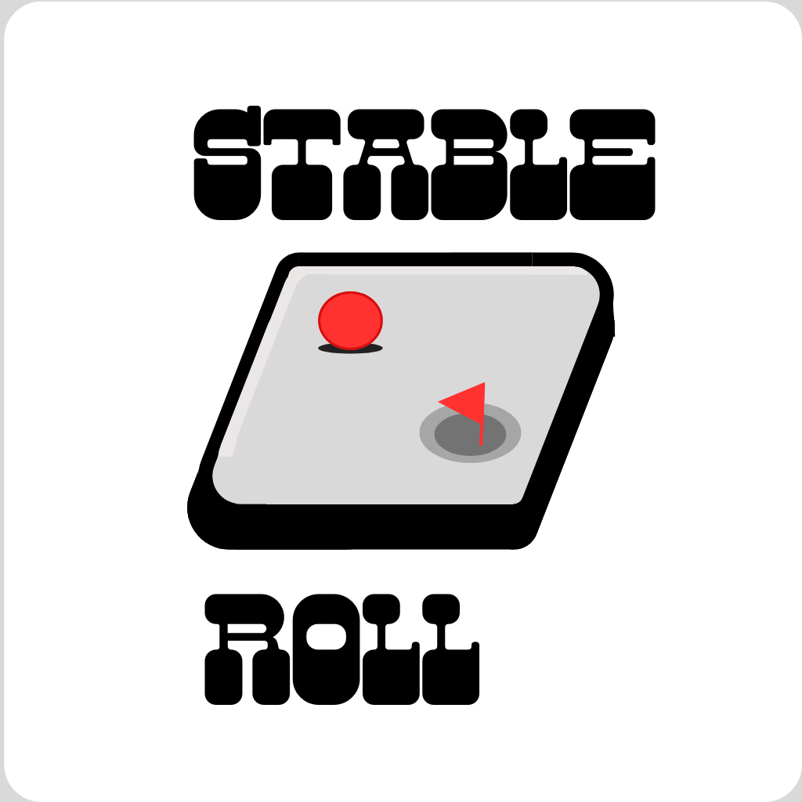

# Relatório Final Projeto 2 de Computação Móvel

Nome: Caio Panta Leão de Souza Fonseca
RA: 24.223.007-6

# Introdução

Este relatório apresenta o desenvolvimento e os resultados do projeto realizado para a disciplina CCP4670. O projeto consiste na criação de um jogo de equilíbrio em React Native, utilizando o acelerômetro do celular. O aplicativo visa demonstrar o conhecimento sobre React Native e uso de sensores do celular.

# Motivação

A escolha por desenvolver um jogo sobre equilíbrio surgiu ao observar o uso do acelerômetro, que lembrava muito as brincadeiras de equilíbrio da vida real, onde se segura uma plataforma com buracos e é preciso fazer com que uma bola atravesse todo o percurso sem cair, utilizando apenas a gravidade como forma de movimento. O uso do acelerômetro no celular faz com que o jogador tenha uma experiencia similar a brincadeira de verdade. 

# Objetivo

O objetivo principal deste projeto é desenvolver um aplicativo mobile funcional em React Native que possibilite a criação de tabuleiros funcionais em que o usuário possa jogar, além do armazenamento desses tabuleiros. O projeto busca: Implementar a criação, remoção e visualização de tabuleiros e a jogabilidade desses tabuleiros; utilizar o AsyncStorage para guardar os tabuleiros criados em arrays; integrar o acelerômetro no jogo para usar a função de equilíbrio; utilizar o StackNavigator para uma experiência de usuário intuitiva e agradável.
# Funcionalidades

O aplicativo desenvolvido conta com as seguintes funcionalidades:

Criar tabuleiro: O usuário pode criar um tabuleiro de 9 linhas e 5 colunas, podendo colocar paredes, obstáculos de derrota, pontos de vitória e o jogador em cada casa do tabuleiro, mas o usuário deve fornecer um nome ao tabuleiro e inserir pelo menos um ponto de vitória e apenas um jogador.
Visualizar tabuleiro: É mostrado ao usuário todos os tabuleiros armazenados no AsyncStorage, mostrando as opções de excluir e de jogar, que podem ser feitas para todos tabuleiros.
Excluir tabuleiro: Remove o Tabuleiro selecionado do AsyncStorage.
Jogar no tabuleiro: Ativa o jogo com o Tabuleiro selecionado, o usuário deve usar o acelerômetro do celular para navegar a bola vermelha(jogador) até o ponto de vitória, evitando os obstáculos de derrota. Se o jogador chegar até o ponto ele vence, mas se ele acabar caindo em um buraco de derrota ele perde. Também existe colisão com as paredes que bloqueiam o jogador.

# Conclusão

A partir do desenvolvimento deste projeto, foi possível fazer uma réplica da brincadeira de equilíbrio digitalmente, utilizando o React Native como base. Ao utilizar as bibliotecas que não havia conhecido antes, enfrentei alguns desafios ao desenvolver o aplicativo por conta de versões e funções conflitantes, mas graças a isso, obtive conhecimento sobre essas bibliotecas. Atualmente o jogo aparenta simples, e pode se beneficiar de outros aspectos conhecidos em jogos, como efeitos sonoros, musicas, pontuações, vidas e etc.

# Outras considerações - Apagar este tópico no relatório final.

Em repositórios do GitHub recomenda-se que imagens, vídeos, etc. sejam anexados de forma local utilizando ``. Por exemplo, para adicionar uma imagem utiliza-se o seguinte:

.jpeg)
.jpeg)
.jpeg)
.jpeg)
.jpeg)
.jpeg)
